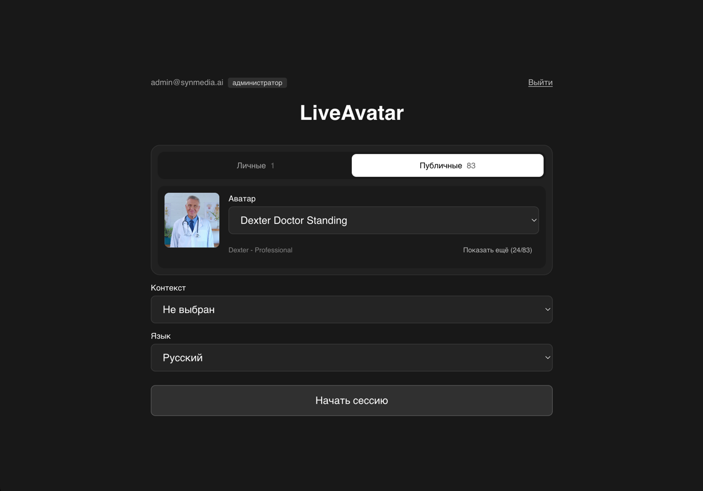
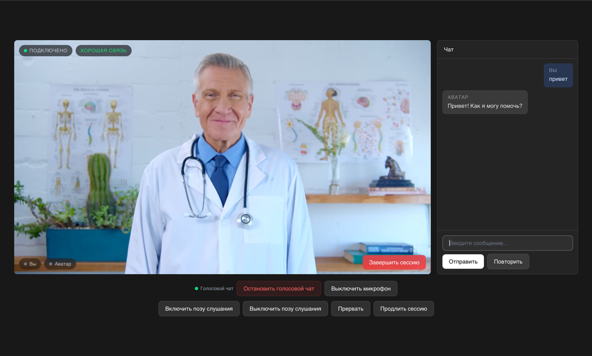

# Live Avatar

**Live Avatar** is a simple Next.js application that allows real-time interaction with an AI-powered avatar via chat or speech. The avatar is rendered and streamed using the [HeyGen API](https://docs.liveavatar.com/), offering a responsive and engaging user experience.

## Interface

### Session setup



Select a personal or public avatar, an optional context, and the avatar's spoken
language before starting a session. Public avatars are loaded from the shared
LiveAvatar catalog and include a preview and default voice.

### Live session



The live session combines the avatar video stream with text chat, connection
status, voice chat, microphone controls, listening-pose controls, and session
management actions.

## Project Structure

```text
.
├── assets/                     # Screenshots used in this README
├── src/
│   ├── actions/                # Reusable avatar session actions
│   ├── app/
│   │   ├── api/                # Authentication and LiveAvatar API routes
│   │   ├── login/              # Login page
│   │   ├── error.tsx           # Global error screen
│   │   ├── layout.tsx          # Root layout and toast container
│   │   └── page.tsx            # Main application page
│   ├── components/             # Session setup and live session UI
│   ├── data/                   # Supported language options
│   ├── hooks/                  # Chat, voice, and session hooks
│   ├── lib/
│   │   ├── auth/               # Users, JWTs, and session cookies
│   │   └── live-avatar/        # Public avatar API helpers
│   ├── logic/                  # LiveAvatar SDK context and event handling
│   ├── types/                  # Shared TypeScript types
│   └── proxy.ts                # Authentication guard
├── .env.example                # Environment variable template
├── docker-compose.yml          # Docker Compose configuration
├── Dockerfile                  # Production container image
├── next.config.ts              # Next.js configuration
├── package.json                # Dependencies and scripts
└── pnpm-workspace.yaml         # pnpm workspace configuration
```

## Getting Started

### 1. Set up environment variables:

Create .env.production file based on the provided .env.example:

```bash
cp .env.example .env.production
```

Then fill in the required variable:

```
API_KEY_HEYGEN=your-api-key
NEXT_PUBLIC_BASE_API_URL_HEYGEN=https://api.liveavatar.com
```

To get the API_KEY, you need to create it on the official website https://app.liveavatar.com.

Other variables in .env.example are optional and can be configured as needed.

### Authentication

The app is protected by a simple email/password login. Configure users via two
environment variables:

```
# Secret used to sign the session cookie (any long random string).
# Generate one with: openssl rand -base64 32
AUTH_SECRET=change-me-to-a-long-random-string

# Users as a JSON array (single line).
USERS=[{"email":"admin@example.com","password":"admin","role":"admin"},{"email":"user@example.com","password":"user","role":"user","avatarIds":["avatar_id_1"],"contextIds":["context_id_1"]}]
```

Roles:

- `admin` — access to **all** avatars and contexts.
- `user` — access to all public avatars plus the personal avatars/contexts listed
  in `avatarIds` and `contextIds`. The lists and public catalog are verified
  server-side when a session starts.

Passwords are stored in plain text in the `USERS` variable — keep `.env.production`
out of version control.

### 2. Install dependencies:

Choose your preferred package manager:

```bash
npm install
# or
yarn
# or
pnpm install
```

### 3. Run the app locally:

```bash
npm run dev
# or
yarn dev
# or
pnpm dev
```

Open http://localhost:3000 to view it in the browser.

## Running with Docker

To launch the app in a Docker container:

```bash
docker compose up --build -d
```

Make sure to update the environment variables in the .env file or configure them through Docker.

## License

This project is distributed under the [MIT License](LICENSE).
